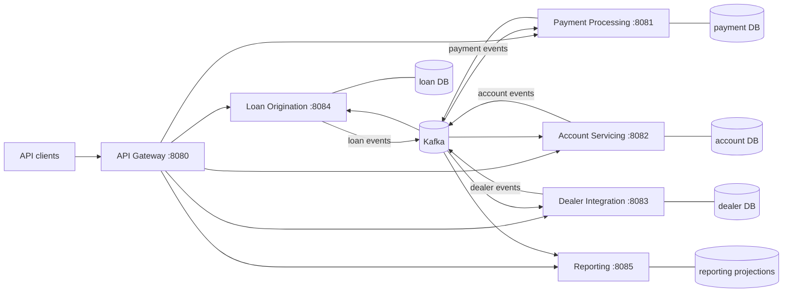

# API Modernization Demo — Event-Driven Auto Finance Platform

This repository shows the completed decomposition of a shared-database Spring Boot monolith into five independently runnable bounded contexts, a public API gateway, shared event contracts, and Kafka messaging infrastructure. The original static-analysis artifacts remain the **before-state** record of the monolith; the root `src/` implementation has been removed.

## Architecture



Each domain owns its code and H2 database. Services exchange facts through the shared event contracts and never depend on another service's implementation module or database.

## Modules and Ports

| Module | Port | Public routes | Responsibility |
|---|---:|---|---|
| `microservices/api-gateway` | 8080 | `/api/**` | Preserves the public monolith paths and routes requests to bounded contexts |
| `microservices/payment-processing-service` | 8081 | `/api/payments/**` | Payment submission, allocation, ACH processing, and late fees |
| `microservices/account-servicing-service` | 8082 | `/api/accounts/**` | Account lifecycle, balances, payoff, delinquency, and termination |
| `microservices/dealer-integration-service` | 8083 | `/api/dealers/**` | Dealer and deal-package workflows, reserves, holdbacks, and settlement |
| `microservices/loan-origination-service` | 8084 | `/api/loans/**` | Application intake, credit decisions, terms, and funding |
| `microservices/reporting-service` | 8085 | `/api/reports/**` | Read-only CQRS portfolio, delinquency, and dealer-performance projections |
| `events` | — | — | Immutable domain-event contracts and stable topic names |
| `messaging` | — | — | Kafka publisher and producer configuration |

## Kafka Event Flow

Events are published to one topic per producing bounded context:

| Topic | Authoritative events | Principal consumers |
|---|---|---|
| `autofinance.loan-origination.events` | `LoanApplicationSubmitted`, `CreditDecisionMade`, `LoanFunded` | Account servicing, dealer integration, reporting |
| `autofinance.payment-processing.events` | `PaymentReceived`, `PaymentAllocated`, `PaymentProcessed`, `LateFeesAssessed` | Account servicing, loan origination, reporting |
| `autofinance.account-servicing.events` | `AccountCreated`, `AccountBalanceUpdated`, `AccountDelinquent` | Payment processing, loan origination, reporting |
| `autofinance.dealer-integration.events` | `DealPackageSubmitted`, `DealerSettlementCalculated` | Loan origination, reporting |

Consumers use event IDs as an idempotent inbox key. Domain projections are upserted so supported event sequences converge even when related events arrive out of order.

The reporting service subscribes to all four topics and writes only its own JPA projection tables. Its preserved read contracts are:

- `GET /api/reports/portfolio`
- `GET /api/reports/delinquency`
- `GET /api/reports/dealers`

## Build and Test

Requirements:

- Java 17 runtime (sources remain Java 8 compatible)
- Maven 3.8+
- Kafka available at `localhost:9092`, or set `KAFKA_BOOTSTRAP_SERVERS`

```bash
# Compile the complete reactor
mvn -B compile --no-transfer-progress

# Run all module tests
mvn -B test --no-transfer-progress

# Run one service and its required shared modules
mvn -B -pl microservices/reporting-service -am test --no-transfer-progress

# Python static-analysis lint
ruff check analysis/
```

To run the platform, start Kafka, then launch the six applications in separate shells:

```bash
mvn -pl microservices/payment-processing-service spring-boot:run
mvn -pl microservices/account-servicing-service spring-boot:run
mvn -pl microservices/dealer-integration-service spring-boot:run
mvn -pl microservices/loan-origination-service spring-boot:run
mvn -pl microservices/reporting-service spring-boot:run
mvn -pl microservices/api-gateway spring-boot:run
```

Call the APIs through the gateway at port 8080. Each service may also be run directly on its module port.

## Before-State Analysis and Modernized Boundaries

The Python analysis engine documents how the former monolith was understood before extraction:

- [`analysis/domain_boundary.py`](analysis/domain_boundary.py) defines the five bounded contexts and maps legacy endpoints, services, entities, coupling, and extraction complexity to the target service modules.
- [`analysis/event_catalog.py`](analysis/event_catalog.py) defines the authoritative events, producers, consumers, and payload fields used by the shared `events` module and Kafka consumers.
- [`dashboard/data/`](dashboard/data/) is reserved for the preserved before-state JSON produced from the original monolith.
- [`dashboard/index.html`](dashboard/index.html) visualizes that analysis, and [`docs/`](docs/) contains the implementation plan and demo flow.

Do **not** rerun `python -m analysis.analyze_monolith src dashboard/data` after decomposition. The root monolith source no longer exists, and regenerating from the decomposed tree would overwrite the ground-truth before-state rather than describe the original system.

## Repository Layout

```text
events/                                  Shared domain-event contracts
messaging/                               Kafka publishing infrastructure
microservices/
  api-gateway/                           Public routing, port 8080
  payment-processing-service/            Payment bounded context, port 8081
  account-servicing-service/             Account bounded context, port 8082
  dealer-integration-service/            Dealer bounded context, port 8083
  loan-origination-service/              Loan bounded context, port 8084
  reporting-service/                     Read-only CQRS projections, port 8085
analysis/                                Preserved monolith analysis engine
dashboard/                               Before-state architecture dashboard
docs/                                    Modernization plan and visual flow
pom.xml                                  Multi-module Maven reactor
```
