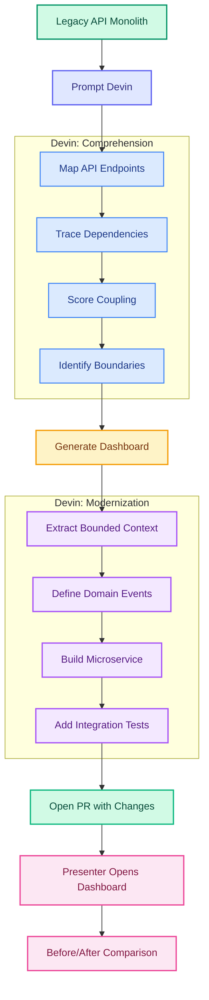
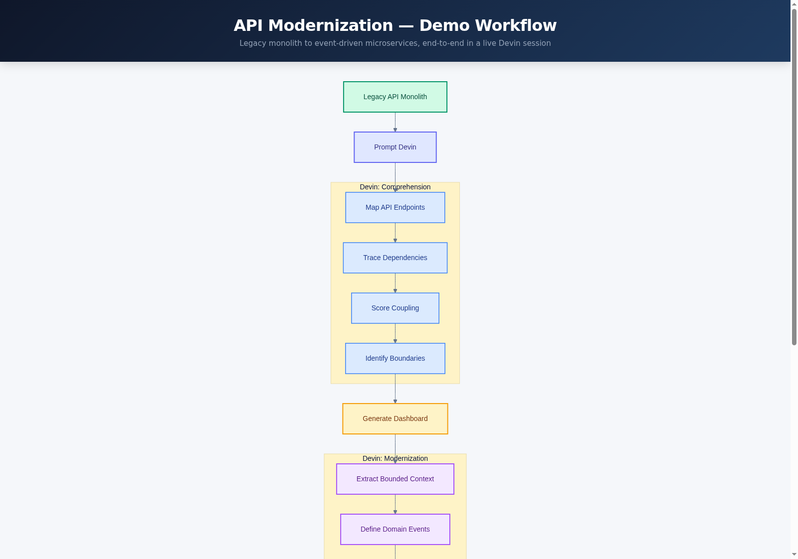

# API Modernization Demo — Legacy Monolith to Event-Driven Microservices



> For the full interactive version, see [`docs/flowchart.html`](docs/flowchart.html).

<details>
<summary>Static flowchart image (click to expand)</summary>



</details>

## What This Demo Shows

An AI agent analyzes a realistic legacy auto-finance monolithic API — 5 tightly-coupled domains sharing a single database with synchronous cross-domain calls — and decomposes it into event-driven microservices. The agent maps every endpoint, traces service dependencies, scores coupling, identifies bounded contexts, and then converts one domain into a working microservice with domain events, CQRS patterns, and integration tests. The audience sees the coupling quantified in a live dashboard and the modernization produced in real time.

## What Devin Does Live

Devin analyzes the legacy monolith by parsing the Java source code, mapping all 20+ REST endpoints across 5 controllers, tracing service dependency chains (e.g., `LoanService` directly accesses 5 repositories across 4 domains), and calculating coupling scores. It generates an interactive modernization dashboard showing the endpoint inventory, service dependency graph, proposed domain boundaries, and a catalog of 14 domain events that should replace the synchronous calls. Devin then extracts the Payment Processing bounded context and produces a standalone Spring Boot microservice with domain events (`PaymentReceived`, `PaymentAllocated`, `PaymentProcessed`, `LateFeesAssessed`), CQRS-style command/query separation, and integration tests — opening a PR with the full diff.

## How the Demo Runs

**Trigger**: The presenter prompts Devin in a live session with the repo URL and a modernization instruction.

**What Devin does end-to-end**:
1. Clones the repo and analyzes the Java source structure
2. Runs `python -m analysis.analyze_monolith src dashboard/data` to parse endpoints, build the dependency graph, score coupling, identify domain boundaries, and generate the event catalog
3. Opens the dashboard (`dashboard/index.html`) — data panels populate with analysis results
4. Extracts the Payment Processing bounded context from the monolith
5. Produces a standalone Spring Boot microservice in `microservices/payment-service/` with domain events, event publisher/consumer, and integration tests
6. Opens a PR with the modernized code

**Visual artifacts**: Modernization dashboard (interactive HTML), Swagger UI (`/swagger-ui.html`), before/after architecture comparison in the PR.

### Local Development

```bash
git clone https://github.com/tedfoley-cog/api-modernization-demo.git
cd api-modernization-demo

# Run the legacy monolith
mvn spring-boot:run
# Swagger UI:  http://localhost:8080/swagger-ui.html
# H2 Console:  http://localhost:8080/h2-console (JDBC URL: jdbc:h2:mem:autofinancedb)

# Run the analysis scripts
python -m analysis.analyze_monolith src dashboard/data

# View the dashboard
open dashboard/index.html
```

## Repo Layout

```
api-modernization-demo/
├── docs/
│   ├── IMPLEMENTATION_PLAN.md        ← Research and implementation plan
│   ├── flowchart.html                ← Interactive demo flow (Mermaid)
│   └── flowchart.png                 ← Flowchart image
├── src/main/java/com/acme/autofinance/
│   ├── AutoFinanceApplication.java   ← Spring Boot main class
│   ├── config/AppConfig.java         ← JdbcTemplate config
│   ├── controller/                   ← 5 REST controllers (Loan, Payment, Account, Dealer, Report)
│   ├── service/                      ← 5 service classes (LoanService is the "god service")
│   ├── model/                        ← 6 JPA entities + 4 enums (anemic domain model)
│   └── repository/                   ← 5 JPA repositories
├── src/main/resources/
│   ├── application.properties        ← Monolithic config (shared H2 database)
│   └── data.sql                      ← Seed data (dealers, loans, payments, accounts)
├── analysis/                         ← Python analysis scripts
│   ├── analyze_monolith.py           ← Main entry point
│   ├── dependency_graph.py           ← Service dependency graph builder
│   ├── coupling_scorer.py            ← Coupling score calculator
│   ├── domain_boundary.py            ← Domain boundary identifier
│   └── event_catalog.py              ← Domain event catalog generator
├── dashboard/
│   ├── index.html                    ← Interactive modernization dashboard
│   └── data/                         ← JSON output (starts empty, Devin populates)
├── microservices/                    ← Empty — Devin fills during live demo
├── events/                           ← Empty — Devin fills during live demo
├── .github/workflows/ci.yml          ← CI: compile Java + lint Python
├── pom.xml                           ← Maven build (Spring Boot 2.7.18, Java 8 source)
├── README.md                         ← This file
└── DEMO_NOTES.md                     ← Presenter cheat sheet
```

## Key Concepts

| Term | Description |
|---|---|
| **Bounded Context** | A domain boundary where a specific business capability lives with its own data and logic |
| **Domain Event** | An immutable record of something that happened in a domain (e.g., `PaymentReceived`) |
| **CQRS** | Command Query Responsibility Segregation — separate models for reads and writes |
| **Anemic Domain Model** | Anti-pattern where entities are just data holders with no business logic |
| **God Service** | Anti-pattern where one service handles too many responsibilities |
| **Coupling Score** | Metric measuring how many cross-domain dependencies a service has |
| **Event Bus** | Message channel where domain events are published and consumed |
| **Synchronous Coupling** | When one service directly calls another and waits for a response |
| **ACH** | Automated Clearing House — US electronic payment network |
| **TILA / ECOA** | Truth in Lending Act / Equal Credit Opportunity Act — regulatory requirements |
