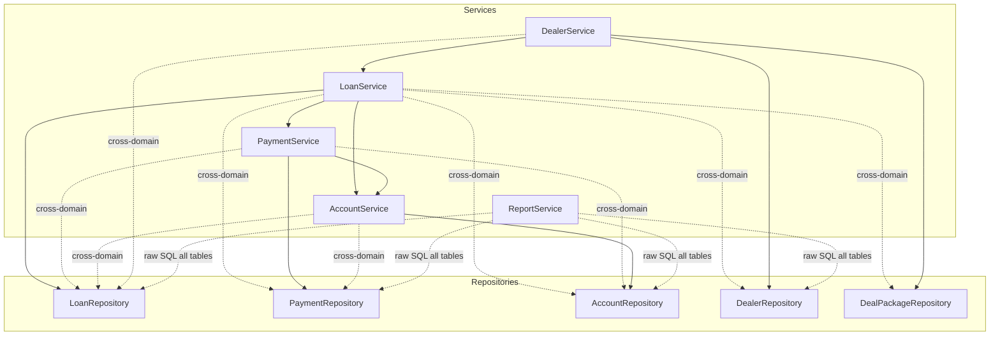
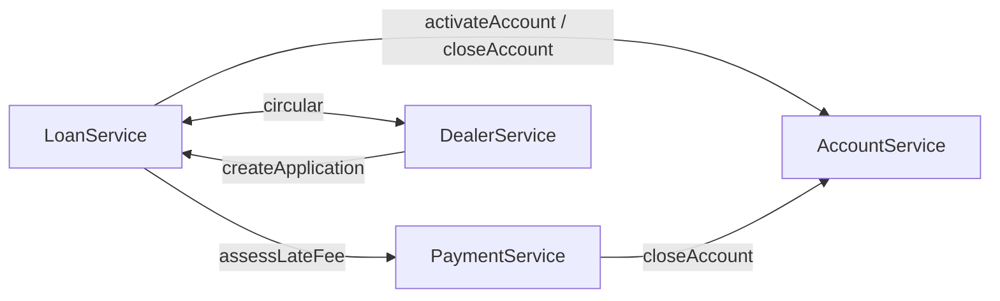
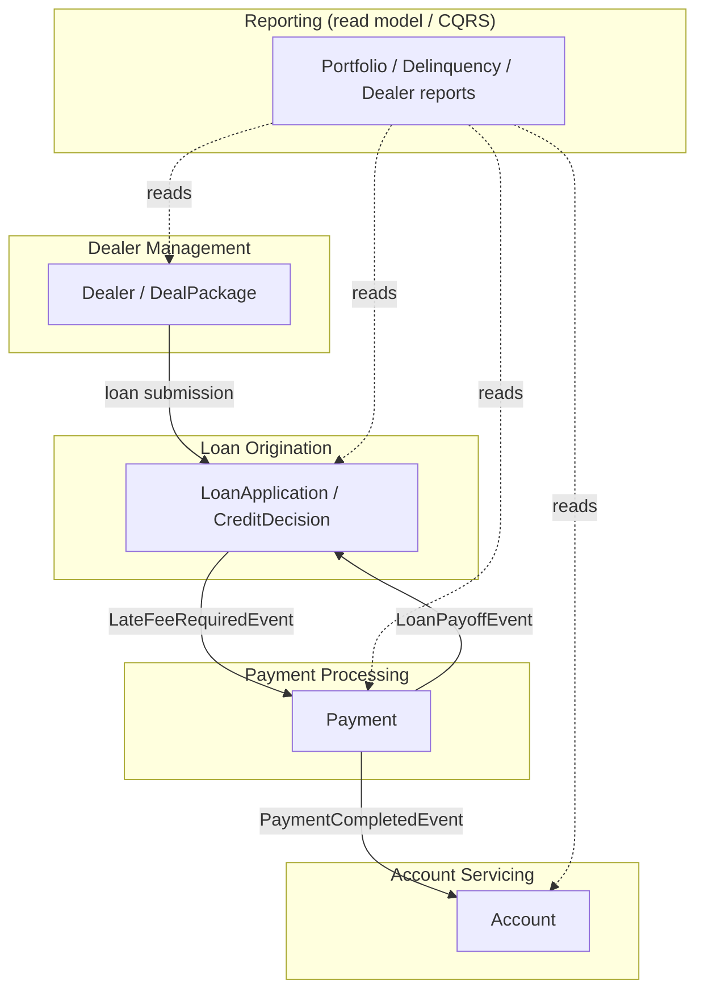

# Modernization Analysis Dashboard — Auto Finance Platform

> Decomposition analysis of the `com.acme.autofinance` Spring Boot monolith.
> Goal: identify bounded contexts and rank them for extraction into event-driven
> microservices. Payment Processing is the recommended first extraction (and is
> implemented in this PR — see [Part B](#part-b-payment-processing-extraction-implemented-in-this-pr)).

---

## 1. Endpoint Mapping

All REST controllers live under `src/main/java/com/acme/autofinance/controller/`.
Every endpoint delegates to a `@Service`; the service column shows the *primary*
service invoked.

### `LoanController` — `/api/loans`
| Method | Path | Request | Response | Service call |
|--------|------|---------|----------|--------------|
| POST | `/api/loans` | `LoanApplication` (body) | `201` `LoanApplication` | `LoanService.createApplication` |
| GET | `/api/loans/{id}` | path `id` | `LoanApplication` | `LoanService.getApplication` |
| GET | `/api/loans/number/{applicationNumber}` | path `applicationNumber` | `LoanApplication` | `LoanService.getByApplicationNumber` |
| GET | `/api/loans?status=` | query `status` | `List<LoanApplication>` | `LoanService.getByStatus` / `getAllApplications` |
| PUT | `/api/loans/{id}/terms` | query `amount,rate,termMonths` | `LoanApplication` | `LoanService.updateTerms` |
| POST | `/api/loans/{id}/fund` | path `id` | `LoanApplication` | `LoanService.fundLoan` |
| POST | `/api/loans/end-of-day` | — | `Map<String,Object>` | `LoanService.runEndOfDayProcessing` |

### `PaymentController` — `/api/payments`
| Method | Path | Request | Response | Service call |
|--------|------|---------|----------|--------------|
| POST | `/api/payments` | `Payment` (body) | `201` `Payment` | `PaymentService.submitPayment` |
| GET | `/api/payments/loan/{loanId}` | path `loanId` | `List<Payment>` | `PaymentService.getPaymentHistory` |
| POST | `/api/payments/batch` | `List<Payment>` (body) | `Map<String,Object>` | `PaymentService.processBatchPayments` |
| GET | `/api/payments/pending` | — | `List<Payment>` | `PaymentService.getPendingPayments` |

### `AccountController` — `/api/accounts`
| Method | Path | Request | Response | Service call |
|--------|------|---------|----------|--------------|
| GET | `/api/accounts/{id}` | path `id` | `Account` | `AccountService.getAccountDetails` |
| GET | `/api/accounts/number/{accountNumber}` | path `accountNumber` | `Account` | `AccountService.getByAccountNumber` |
| PUT | `/api/accounts/{id}/address` | query `address` | `Account` | `AccountService.updateAddress` |
| GET | `/api/accounts/{id}/payoff` | path `id` | `Map<String,Object>` | `AccountService.calculatePayoffQuote` |
| POST | `/api/accounts/{id}/early-termination` | path `id` | `Map<String,Object>` | `AccountService.processEarlyTermination` |
| GET | `/api/accounts/delinquent?daysPastDue=` | query `daysPastDue` | `List<Account>` | `AccountService.getDelinquentAccounts` |

### `DealerController` — `/api/dealers`
| Method | Path | Request | Response | Service call |
|--------|------|---------|----------|--------------|
| POST | `/api/dealers/deals` | `DealPackage` (body) | `201` `DealPackage` | `DealerService.submitDealPackage` |
| GET | `/api/dealers/{dealerId}/settlement` | path `dealerId` | `Map<String,Object>` | `DealerService.getDealerSettlement` |
| GET | `/api/dealers/{dealerId}/inventory-financing` | path `dealerId` | `Map<String,Object>` | `DealerService.getInventoryFinancing` |
| GET | `/api/dealers` | — | `List<Dealer>` | `DealerService.getAllDealers` |

### `ReportController` — `/api/reports`
| Method | Path | Request | Response | Service call |
|--------|------|---------|----------|--------------|
| GET | `/api/reports/portfolio` | — | `Map<String,Object>` | `ReportService.getPortfolioSummary` |
| GET | `/api/reports/delinquency` | — | `Map<String,Object>` | `ReportService.getDelinquencyReport` |
| GET | `/api/reports/dealers` | — | `List<Map<String,Object>>` | `ReportService.getDealerPerformanceReport` |

---

## 2. Service Dependency Trace

Injected dependencies per service (repositories + cross-service calls + raw JDBC).
`*` marks a **cross-domain** repository injection (a service reaching into another
context's data) — the primary coupling smell.

| Service | Repositories | Cross-service calls | Other |
|---------|--------------|---------------------|-------|
| `LoanService` | `LoanRepository`, `PaymentRepository`*, `AccountRepository`*, `DealerRepository`*, `DealPackageRepository`* | `PaymentService`, `AccountService` | `JdbcTemplate` |
| `PaymentService` | `PaymentRepository`, `LoanRepository`*, `AccountRepository`* | `AccountService` | — |
| `AccountService` | `AccountRepository`, `LoanRepository`*, `PaymentRepository`* | — | — |
| `DealerService` | `DealerRepository`, `DealPackageRepository`, `LoanRepository`* | `LoanService` | — |
| `ReportService` | *(none — raw SQL across all domain tables)* | — | `JdbcTemplate` |

### Dependency graph



### Service-to-service call graph (synchronous)



---

## 3. Coupling Score

Each ordered service pair (A → B) is scored **0–10**. Higher = more tightly
coupled = harder/riskier to split. Components:

- **XR** — cross-domain repository injections from A into B's tables (×2, max 4)
- **SC** — synchronous service calls A → B (×2, max 4)
- **TX** — shared `@Transactional` boundary spanning A and B (0 or 1)
- **CD** — participates in a circular dependency with B (0 or 1)

| Pair (A → B) | XR | SC | TX | CD | **Score** |
|--------------|----|----|----|----|-----------|
| LoanService → PaymentService | 2 (`PaymentRepository`) | 2 (`assessLateFee`) | 1 | 0 | **5** |
| LoanService → AccountService | 2 (`AccountRepository`) | 2 (`activate/closeAccount`) | 1 | 0 | **5** |
| LoanService → DealerService | 4 (`Dealer`+`DealPackage` repos) | 0 | 1 | 1 | **6** |
| PaymentService → AccountService | 2 (`AccountRepository`) | 2 (`closeAccount`) | 1 | 0 | **5** |
| PaymentService → LoanService | 2 (`LoanRepository`) | 0 | 1 | 0 | **3** |
| AccountService → LoanService | 2 (`LoanRepository`) | 0 | 0 | 0 | **2** |
| AccountService → PaymentService | 2 (`PaymentRepository`) | 0 | 0 | 0 | **2** |
| DealerService → LoanService | 2 (`LoanRepository`) | 2 (`createApplication`) | 1 | 1 | **6** |
| ReportService → ALL | 4 (raw SQL, every table) | 0 | 0 | 0 | **4** |

**Hotspots**
- `LoanService ↔ DealerService` is a **circular dependency** (`DealerService` calls `LoanService.createApplication`; `LoanService` writes `DealPackage` records). Score 6 each direction.
- `LoanService` is the **God service**: it is the source of the most cross-domain repository injections (4) and the only service that both calls *and* is called by others.
- `ReportService` couples to **every** table via raw `JdbcTemplate` SQL — a read-side concern that is a natural **CQRS / read-model** candidate rather than an extraction.

---

## 4. Domain Boundary Identification (Bounded Contexts)

| Bounded Context | Aggregates / Entities | Repositories | Service(s) |
|-----------------|-----------------------|--------------|------------|
| **Loan Origination** | `LoanApplication`, `CreditDecision` | `LoanRepository` | `LoanService` (origination + credit + EOD) |
| **Payment Processing** | `Payment` (`PaymentMethod`, `PaymentStatus`) | `PaymentRepository` | `PaymentService` |
| **Account Servicing** | `Account` (`AccountStatus`) | `AccountRepository` | `AccountService` |
| **Dealer Management** | `Dealer`, `DealPackage` (`DealStatus`) | `DealerRepository`, `DealPackageRepository` | `DealerService` |
| **Reporting** | *(read-only views over all aggregates)* | raw `JdbcTemplate` | `ReportService` |



---

## 5. Extraction Priority Matrix

Ranked by **extraction readiness** = clear domain boundary + few inbound
(afferent) dependencies + manageable cross-boundary coupling.

| Rank | Context | Afferent deps (who calls in) | Efferent deps (what it calls out) | Extraction complexity | Readiness |
|------|---------|------------------------------|-----------------------------------|-----------------------|-----------|
| **1** | **Payment Processing** | `LoanService` (late fee) | `LoanRepository`, `AccountRepository`, `AccountService` | **Medium** → all outbound calls convert cleanly to events | ⭐⭐⭐⭐⭐ **Recommended first** |
| 2 | Account Servicing | `LoanService`, `PaymentService` | `LoanRepository`, `PaymentRepository` | Medium | ⭐⭐⭐⭐ |
| 3 | Dealer Management | `LoanService` | `LoanRepository`, `LoanService` | High (circular dep with Loan) | ⭐⭐⭐ |
| 4 | Reporting | *(none)* | reads all tables | Medium (best as CQRS read model, not a write service) | ⭐⭐⭐ |
| 5 | Loan Origination | `Payment`, `Account`, `Dealer` | everything | High (God service, central hub) | ⭐⭐ (extract *last*, after peeling others off) |

### Why Payment Processing first
- **Self-contained write model**: only `PaymentService` writes `payments`; no other service mutates payment records.
- **All outbound coupling is event-shaped**: the synchronous side effects after a payment clears (`updateAccountBalance`, `updateLoanAfterPayment`, payoff → `closeAccount`) are fire-and-forget domain reactions — textbook domain events.
- **Single inbound caller**: `LoanService.runEndOfDayProcessing()` → `assessLateFee()`, which inverts cleanly into a `LateFeeRequiredEvent` the Payment context consumes.
- **No circular dependency** (unlike Dealer ↔ Loan).
- **Clear anti-corruption seam**: the only reads Payment needs from other contexts (loan existence, interest rate, current balance) collapse into one read-only `LoanValidationPort`.

---

## Part B: Payment Processing Extraction (implemented in this PR)

This PR delivers the first extraction as an **in-process event-driven module**
(Spring Application Events as a stepping stone toward Kafka/RabbitMQ).

### Before (synchronous, tightly coupled)
```
PaymentService.processAchPayment()
  ├─ accountRepository.save(...)            // writes Account context
  ├─ loanRepository.save(... PAID_OFF)      // writes Loan context
  └─ accountService.closeAccount(...)       // calls Account context

LoanService.runEndOfDayProcessing()
  └─ paymentService.assessLateFee(...)      // calls Payment context
```

### After (event-driven, decoupled)
```
PaymentService.processAchPayment()
  └─ publish PaymentCompletedEvent ─┬─> AccountBalanceEventListener  -> updates Account, emits AccountBalanceUpdatedEvent
                                    └─> LoanStatusEventListener      -> payoff check, emits LoanPayoffEvent
PaymentService (on failure)
  └─ publish PaymentFailedEvent (no account/loan mutation)

LoanService.runEndOfDayProcessing()
  └─ publish LateFeeRequiredEvent  ──> LateFeeEventListener -> assessLateFee, emits LateFeeAssessedEvent
```

### Resulting coupling reduction for Payment Processing
| Coupling | Before | After |
|----------|--------|-------|
| Cross-domain repository injections (`LoanRepository`, `AccountRepository`) | 2 | 0 (replaced by read-only `LoanValidationPort`) |
| Synchronous outbound service calls (`AccountService`) | 1 | 0 |
| Inbound synchronous calls from `LoanService` | 1 (`assessLateFee`) | 0 (event-driven) |

The REST API contract is unchanged — the decoupling is entirely internal.
